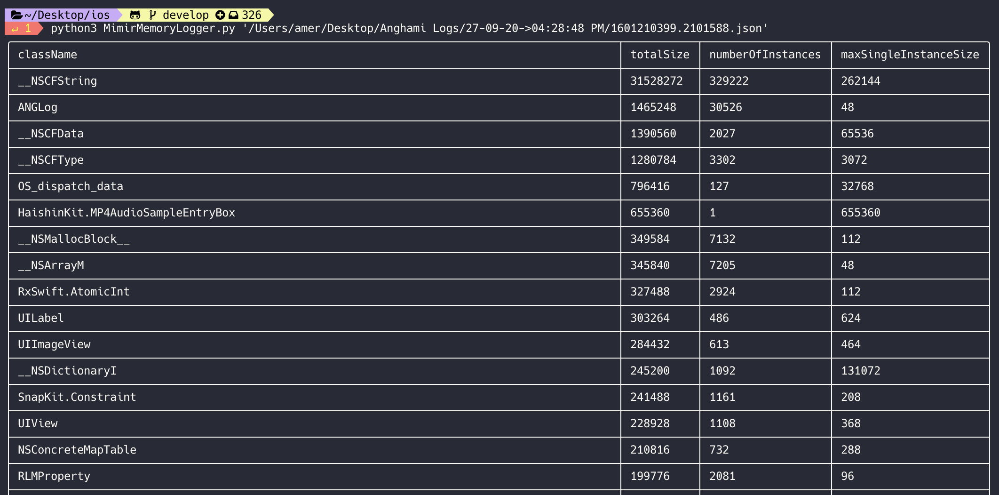
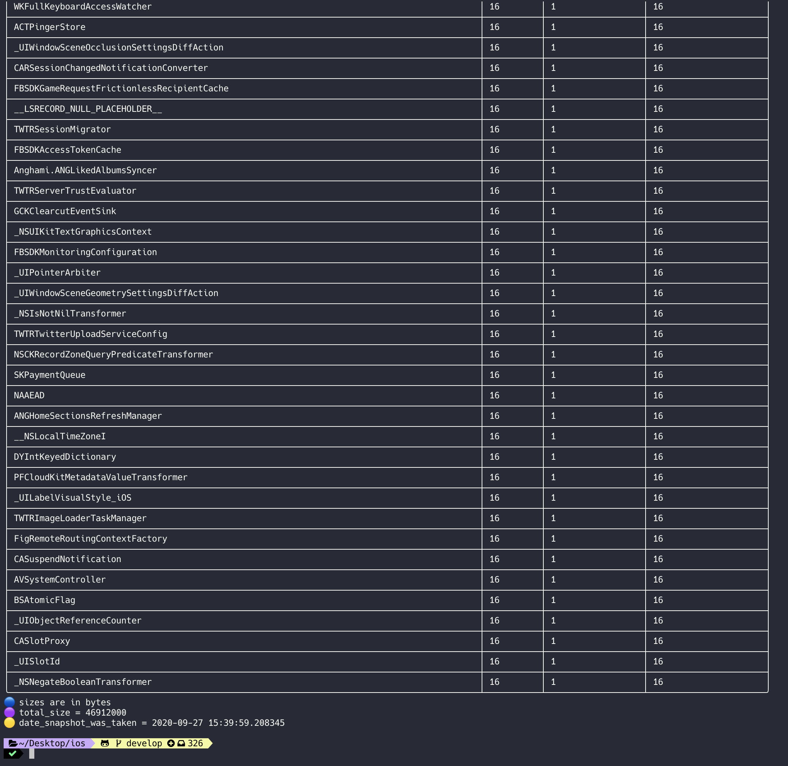

<p align="center">
  
</p>

<p align="center">
    <a href="https://cocoapods.org/pods/MimirMemoryLogger">
      
    </a>
    <a href="https://cocoapods.org/pods/MimirMemoryLogger">
      
    </a>
    <a href="https://cocoapods.org/pods/MimirMemoryLogger">
        
    </a>
    <a href="https://cocoapods.org/pods/MimirMemoryLogger">
        
    </a>
</p>

## Memory heap logging framework for iOS (Memory snapshots)

## Overview
MimirMemoryLogger is a memory logging framework (Swift & Objective-C) that is intended to help developers better debug memory issues when connecting the device to Xcode is not possible.

What this framework does is basically takes a snapshot of the iOS device's heap and saves it to disk as a json file. This json file can then be used alongside a python script i wrote (please don't judge my python code 😅) that loops over all the memory instances in the json file and sorts them accordingly in terminal.

## How it works

1. Trigger saving memory heap snapshot whenever you want (e.g when the app receives `applicationDidReceiveMemoryWarning`)
2. MimirMemoryLogger saves the memory snapshot to disk
3. User sends memory snapshot (automatically or manually) to developer
4. Developer runs python script with the json memory snapshot as a parameter
5. Script shows the memory heap usage of your app which allows the developer to look into the reason of heavy memory usage

### Python Script Samples
These are 2 samples of what the result of using the heap snapshot json file with the python script (included in the repo)





Samples of json memory snapshots are in ./MimirMemoryLogger/Resources/snapshot-samples

# Usage - Swift

## Taking snapshot of memory

```swift
import MimirMemoryLogger // Do not forget this

MimirMemoryLogger.saveCurrentSnapshotToFile { (url) -> (Void) in
  if let url = url {
    print("Memory snapshot location: \(url.absoluteString)")
  }
}
```

## Getting previously saved snapshots

```swift
if let urls = MimirMemoryLogger.getSavedSnapshots() {
  print("URLS of all saved snapshots: \(urls)")
}
```

## Customization
You can set the maximum number of snapshots that persist on disk. Default is 5

```swift
MimirMemoryLogger.maxNumberOfSnapshots = 3
```

If you want more details on what is happening while saving and getting snapshots, you can set verbose to true in MimirMemoryLogger. This will print to console added details and information such as time it takes to save a snapshot or if there are any errors.

```swift
MimirMemoryLogger.verbose = true
```

## Notes

This framework is still in the early phases and will keep evolving.

If you use this framework and happen to like it, feel free to let me know 😊

## Installation

Mimir is available through [CocoaPods](https://cocoapods.org). To install
it, simply add the following line to your Podfile:

```swift
pod 'MimirMemoryLogger'
```

## Author

Amer Eid, amereid92@gmail.com

## License

Mimir is available under the MIT license. See the LICENSE file for more info.
